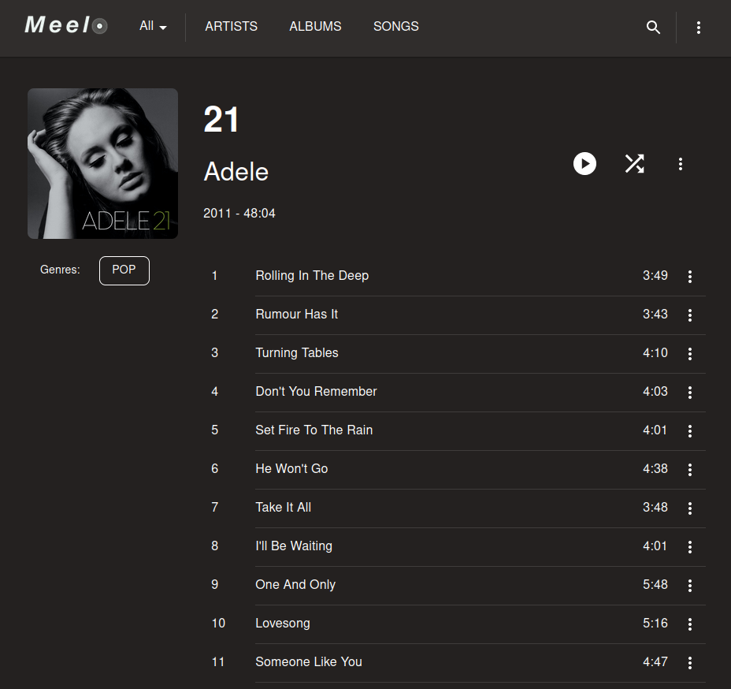
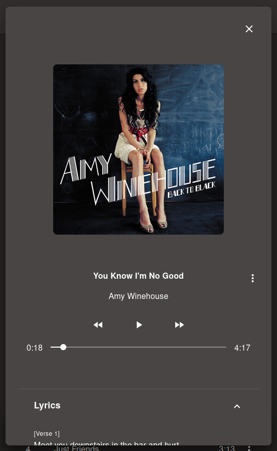
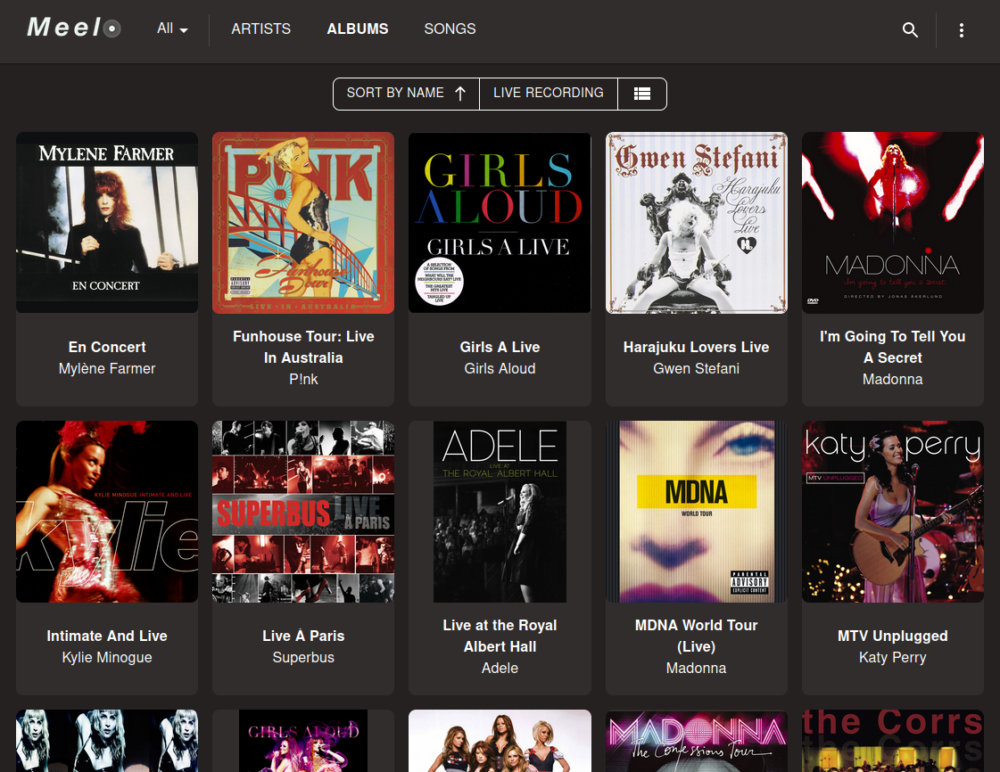
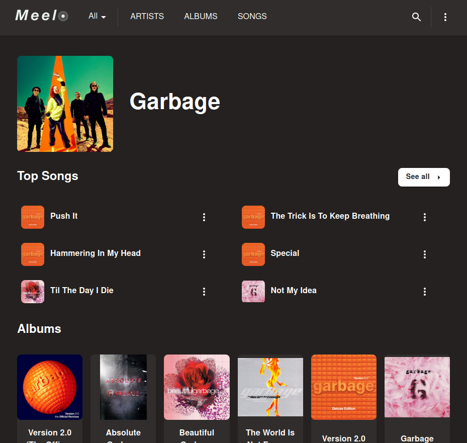
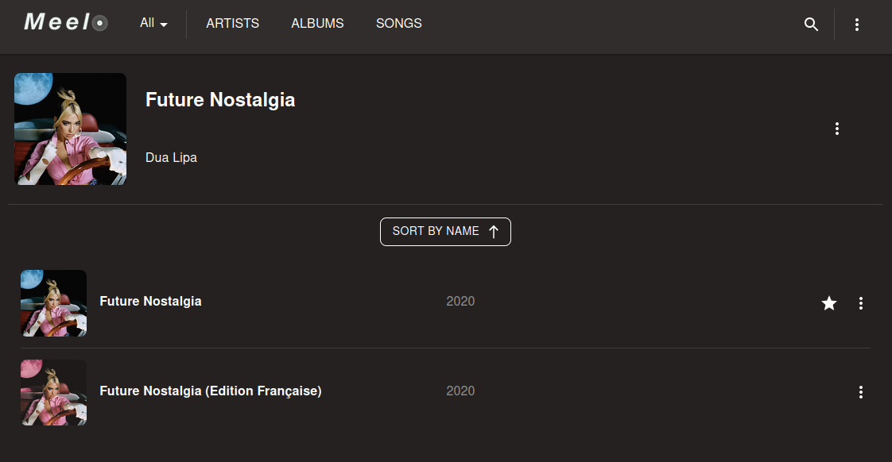
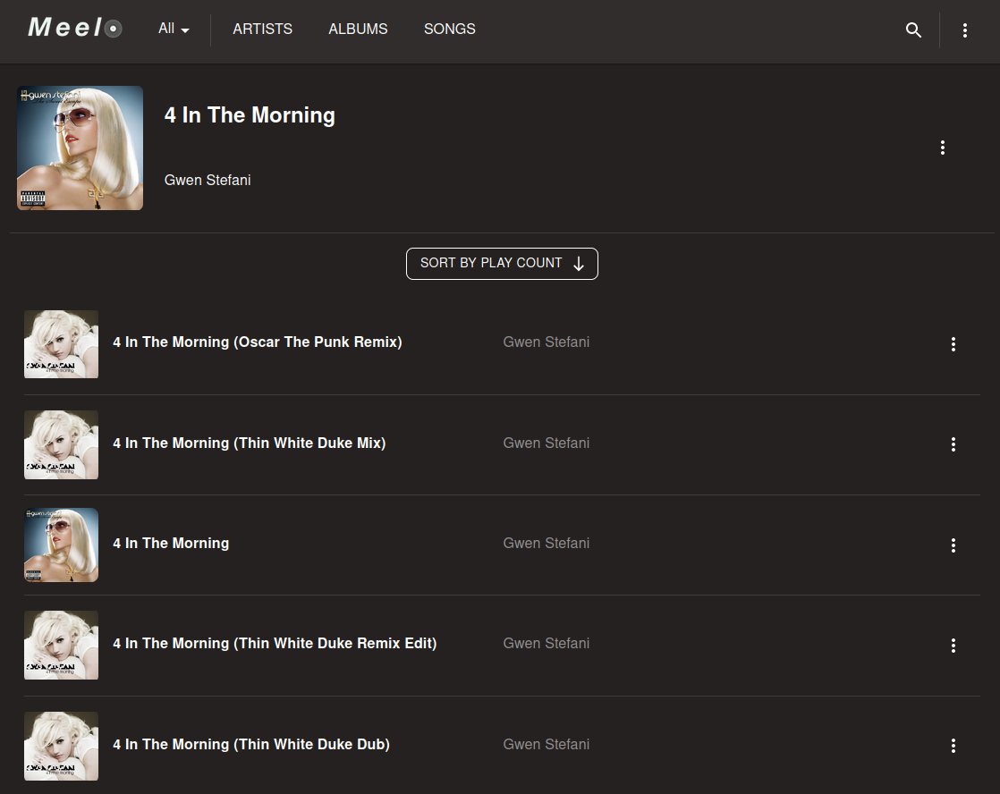

## Your music, your files, your experience

Meelo is a music server and application to enjoy your personal music files anywhere, anytime you want.
This project is made by a music collector, and for music collectors. Its goal is to have a clean, organized, easy and accessible way to store and serve files.

## Getting Started

- [Setup Instructions](https://arthi-chaud.github.io/Meelo/additional-documentation/setting-up.html)
- [What is Meelo made of](https://arthi-chaud.github.io/Meelo/additional-documentation/technologies.html)
- [Code Documentation](https://arthi-chaud.github.io/Meelo/overview.html)

## Features

- Files organized in *Libraries*
- Scan for new files, and remove deleted files
- Music Organization close to a Music Collector's collection
  - Artist
  - Album
    - Releases
  - Songs
    - Tracks
    - Versions
  - With the possibility to select the *main* item.
- Support for Music Videos
- Metadata scan using:
  - Embedded tags (including bitrate)
  - Path of file, using [customizable Regular Expressions](https://arthi-chaud.github.io/Meelo/additional-documentation/setting-up.html#prepare-your-settings)
  - Either using one of the two, or the two combined
- Automatically set type to Albums, based on their title
  - Studio Recording
  - Single
  - Live Album
  - Video Album
  - Soundtrack Album
  - etc..
- ... And allow filtering based on Album's types
- Automated Lyrics download
- Access, stream, and download songs from your server.

Keep track of the incoming features with the [project's issues](https://github.com/Arthi-chaud/Meelo/issues)

## Why Meelo could be what you are looking for

[Plex](https://www.plex.tv/fr/), [Beets](https://github.com/beetbox/beets), [Koel](https://github.com/koel/koel), as well as iTunes are awesome solutions if you have a 'simple' music collection, but is not tailored for music collectors, who usually have multiple versions of a single album, multiple files for one single song (from multiple album releases). Therefore, the library ends up clustered and unpleasant to browse and use.

## The philosophy behind Meelo

The idea behind Meelo is to have a pleasant way to browse and enjoy your collection and making it the *best* one possible.

The *best* music collection is a collection that is fully useable in any music server (like one mentioned above). The only way to reach this goal is to make the music collection independent metadata-wise, i.e. having all the metadata embedded in the files themselves.
To use Meelo, you'll need a 'clean' collection: either with embedded metadata or standard file/folder architecture. Using iTunes is a great way to start.

In the future, Meelo's goal is to help you manage and enjoy your music collection, while keeping it flexible if you ever want to use another music server.

## Screenshots

