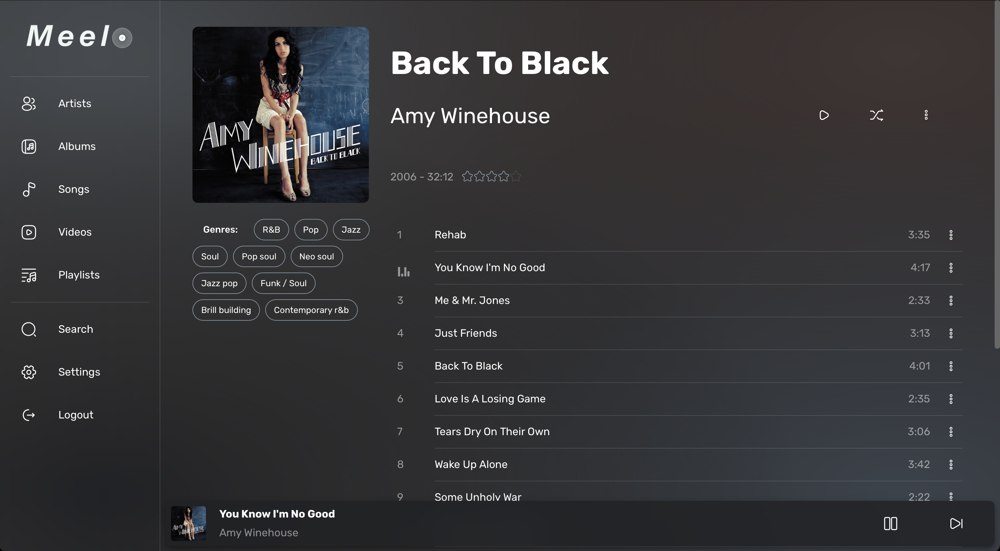
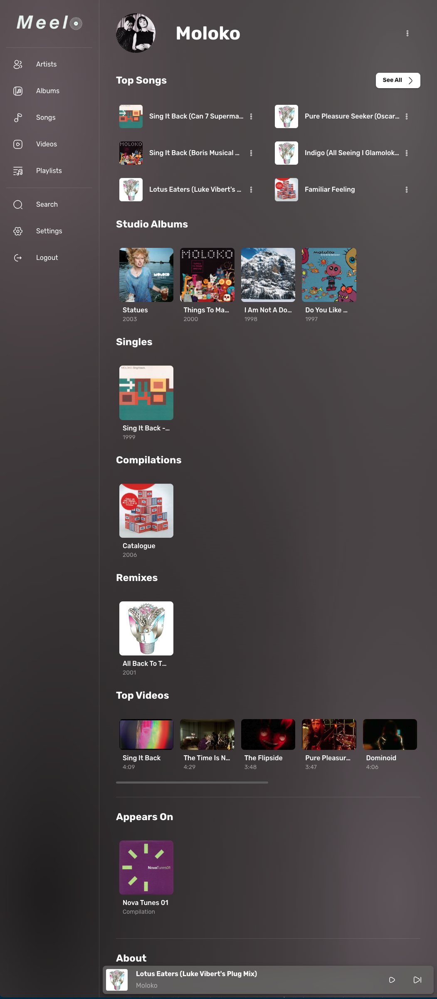
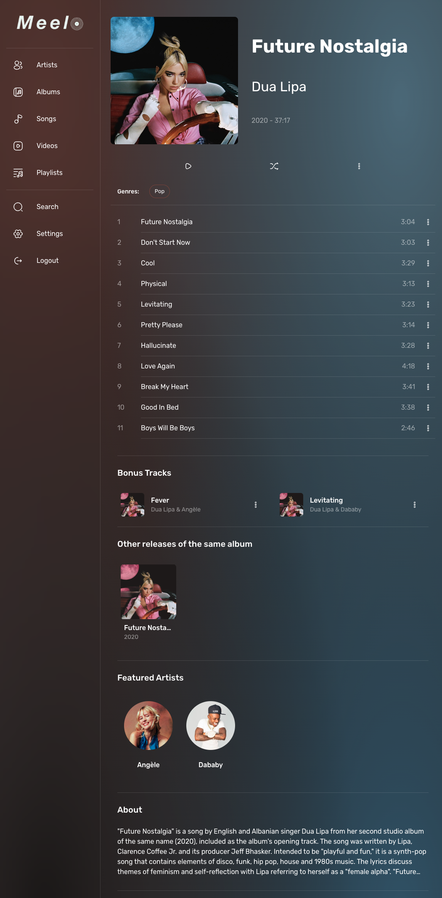

# 

Welcome! Meelo is a self-hosted music server and web app. It works similarly to Plex, Jellyfin, Koel and Black Candy, but focuses on flexibility, browsing and listening experiences. Actually, Meelo is designed for music collectors. What does it mean? Scroll down to see our killer features :arrow_heading_down:

While the software wants to be a flexible as possible, it requires a little bit of setup. However, once everything is ready, you will just have to sit back, relax, and enjoy your music. :sunglasses:

## :star: Features

Meelo has all the basic features you might expect from a music player/server (playback, browsing, search, playlists, libraries ...). But it comes with a handful of features that make it unique :star_struck:

- Music Videos
  - Access them directly from an album's or an artist's page
  - We also differentiate music video from interviews, behind-the-scenes, trailers...
- Identifies B-Sides
  - Meelo shows you any tracks that could be related to an album directly on the album's page!
- ... and Rare tracks
  - And show them on the artist's page, so that these rare gems do not get lost and forgotten!
- Automatic 'featuring' and duet detection
- Albums have _releases_
  - Meaning that you can have multiple versions of a single album
  - But only its _main_ version would appear on browsing pages
  - Of course, you can still access its other versions, directly from the album's page
- Songs have _tracks_
  - It is pretty much the same as for albums and releases
  - No duplicated songs when browsing your library!
- Song Versions
- Browse Songs [grouped by version](./assets/examples/song-groups.png)
- Album and Song types
  - Finding instrumental songs or live recordings has never been this simple!
- Filter Songs that are exclusive to an album (compilations only)
- Supports all formats!
  - Thanks to transcoding and the way we parse files, any audio and video format is virtually supported
  - (Note: Transcoding is only used when the file format is not supported in the browser)
- Flexible metadata parsing
  - Use either the embedded metadata or the file's name (or both!) to extract metadata
  - Also works with album covers!
- Get genres, descriptions, and ratings using MusicBrainz, Genius, Wikipedia and many more providers!
- Download lyrics

Keep track of the upcoming features [here](https://github.com/Arthi-chaud/Meelo/issues)

## :book: How to get started

To use Meelo, you'll need a 'clean' collection: either with embedded metadata or standard file/folder architecture. Using iTunes or Beets is a great way to start.

Meelo is shipped though Docker images. You might need to know a bit about Regexes.
Look over [here](https://arthi-chaud.github.io/Meelo/) for setup instructions.

## :desktop_computer: Live Demo

We are actively working on a public demo, so that you can try out Meelo. Stay tuned...

## :camera: Screenshots

  
Unfold to see what the web application looks like!

More screenshots [here](./assets/examples/)

## :handshake: Contributing and Bugs reporting

:hammer: Would you like to contribute to Meelo? Feel free to [open a pull request](https://github.com/Arthi-chaud/Meelo/compare).

:thinking: Is there a feature you would like to have? [Open an issue](https://github.com/Arthi-chaud/Meelo/issues/new/choose), and we will be happy to discuss it!

:bug: Have you encountered a bug? Ugh we don't like 'em here! Report it by [opening an issue](https://github.com/Arthi-chaud/Meelo/issues/new/choose).

---

Get ready to make the most out of you music collection!

